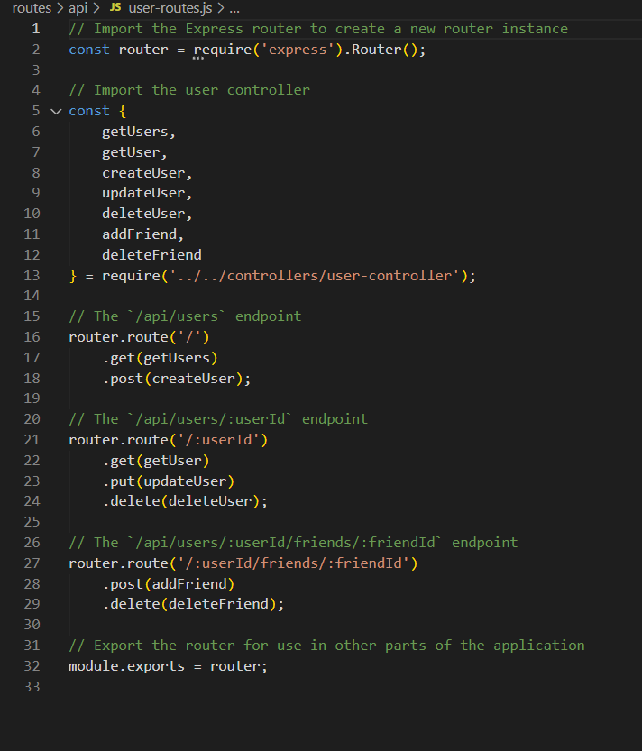
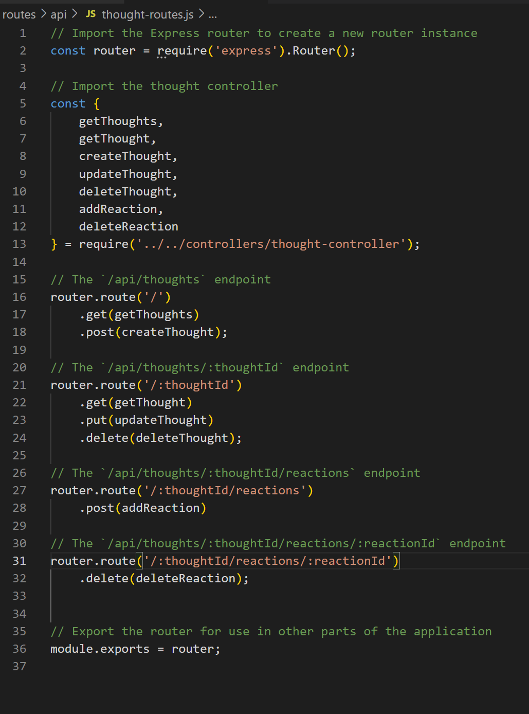
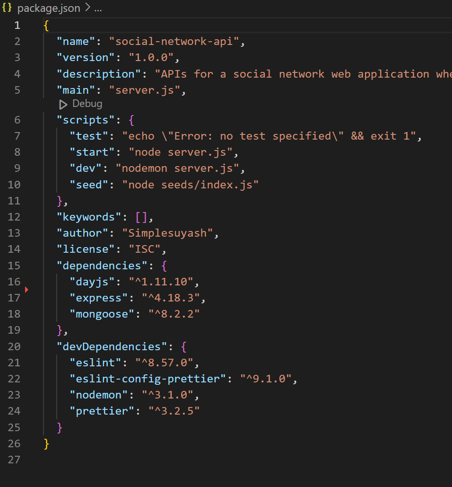
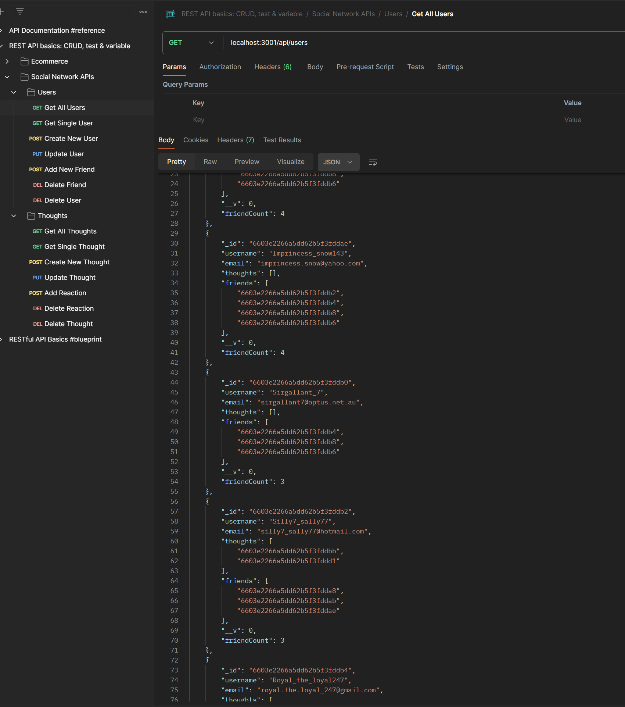
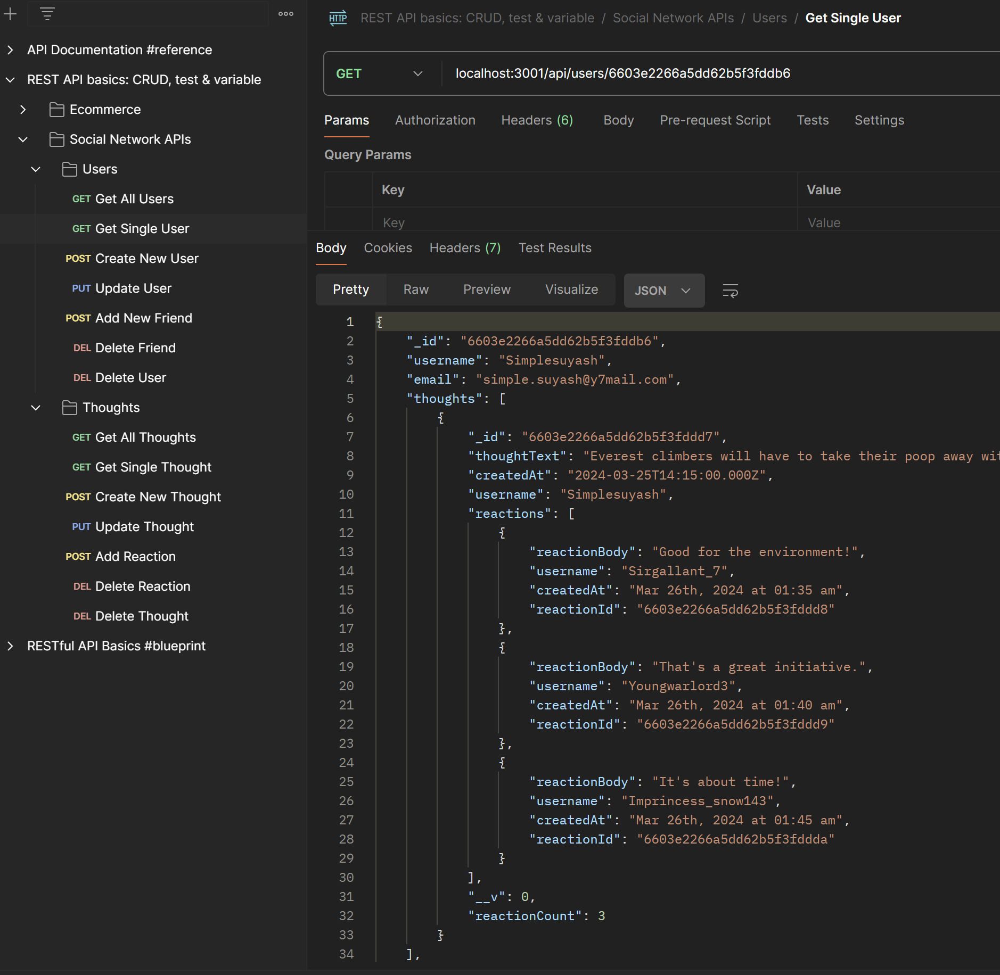
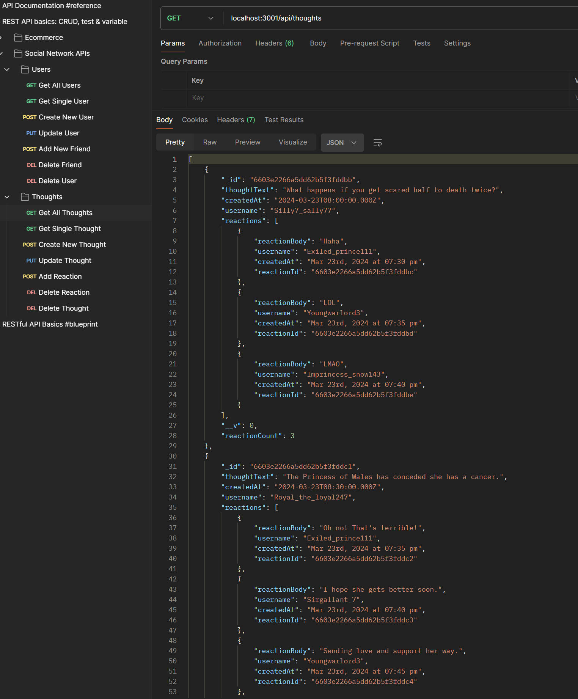

 [](https://nodejs.org/en) [](https://www.npmjs.com/) [](https://expressjs.com/) [](https://mongoosejs.com/) [](https://www.mongodb.com/) [](https://day.js.org/)


<div align="right"> 
<a href= "http://www.wtfpl.net/about/"></a>
</div>

# Social Network APIs   

This app lets users test various APIs of a social network website.

##  Description

With the help of any API client, such as Postman, etc, this app allows us to view the social network site's all users, view a detail information of a particular user, add a new user, delete and update existing an existing user. Also, it allows us to add a new friend to and delete an existing friend from the friend's list of an user. 

Similarly, it lets us get all thought posts, get a particular thought post, add a new thought post, update and delete an existing thought post. We also can add a reaction and delete a particular reaction related to the thought post.

The thought posts and reactions are related to corresponding user record as the creater of the post and reactor to the post respectively. 




By creating this project, I learnt `mongoose`. Mongoose is an Object Data Modeling (ODM) library for MongoDB and Node.js. It manages relationships between data, provides schema validation, and is used to translate between objects in code and the representation of those objects in MongoDB. The problem that Mongoose aims to solve is allowing developers to enforce a specific schema at the application layer.

Having learnt relational database management system such as `MySQL` earlier in the course, I was used to storing data using tables and rows, where referential integrity is enforced. Though this project, I got to learn a non-relational way of storing data, in this case, in a series of JSON like documents, which are called  binary JSON, or `BSON` in short. 


## Table of Contents

1. [Installation](#installation)
1. [Usage](#usage)
1. [Licence](#licence)
1. [Screenshots](#screenshots)
1. [Demo](#demo)


## Installation 

1. Download and Install the `Node.js` 
1. Initialize the project 
    ```       
    npm init -y
    ```
1. Install `Express` server
    ```
    npm i express
    ```
1. Install `day.js` plugin
    ```
    npm i dayjs
    ```
1. Install `Mongoose` Object Data Modeling (ODM) library for MongoDB and Node.js.
    ```
    npm i mongoose
    ```
1. Following are the optional dev dependencies:
    - Install `nodemon` to automatically restart the server everytime code changes
        ```
        npm i -D nodemon
        ```
    - Install `ESLint` to find problematic patterns or code that doesn't adhere to certain style guidelines
        ```
        npm i -D eslint
        ```
    - Install `Prettier` for code formatting
        ```
        npm i -D prettier
        ```
    - Install `eslint-config-prettier` to turn off ESLint rules that might clashes with Prettier
        ```
        npm i -D eslint-config-prettier
        ```

And the `package.json` file should look like below:              


## Usage
If you wish to use this repo,
- Get a copy of this repo to your local machine
- Install the node module in the root directory
    ```
    npm i
    ```
- Again, navigate to root directory, type the following to seed the data
    ```
    npm run seed
    ```
- Start the app
    ```
    npm run start   
    ```
- Open up any API client like Postman, and test the API endpoints


## Licence

This app is licensed under [**WTFPL**](http://www.wtfpl.net/about/)

## Screenshots

Screenshot showing the get all users endpoint 


Screenshot showing the get single user endpoint


Screenshot showing the get all thoughts endpoint


## Demo

